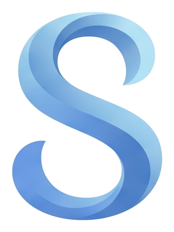
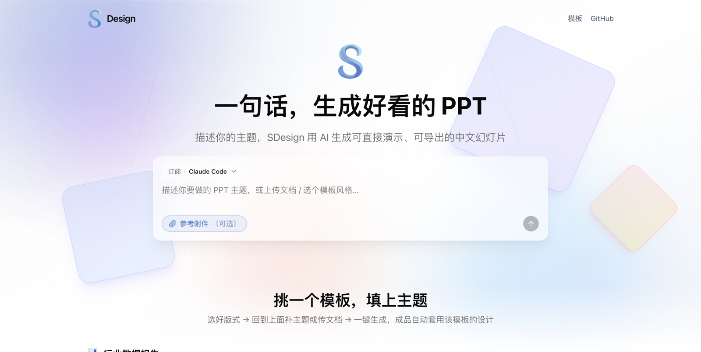
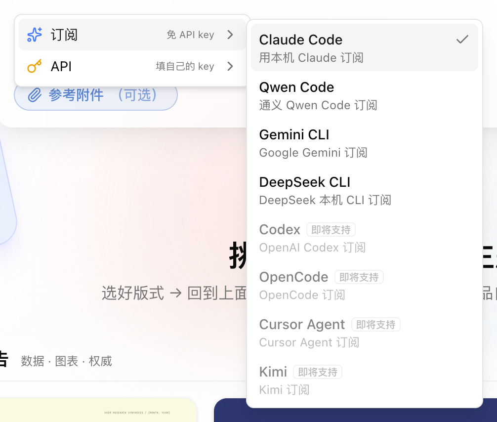
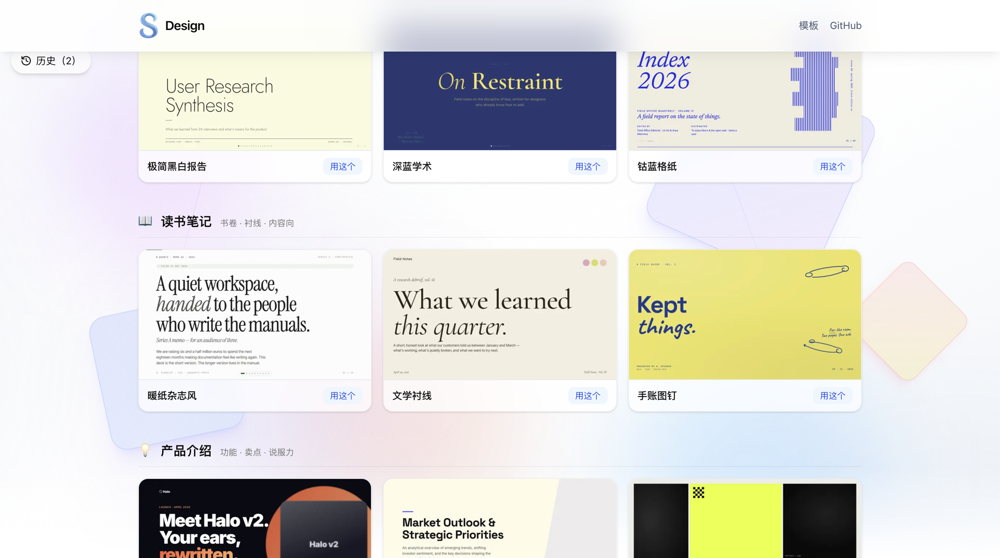
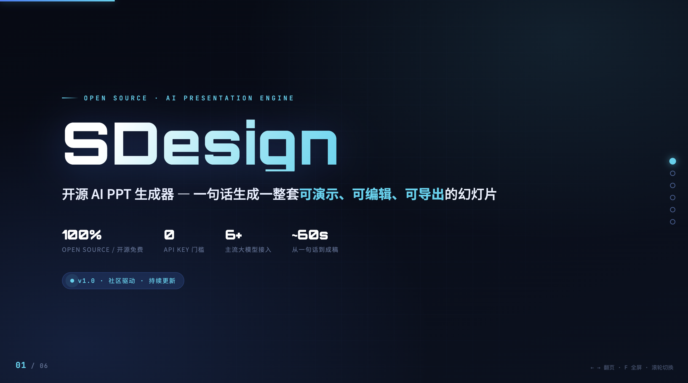

<p align="center">
  
</p>

<h1 align="center">SDesign</h1>

<p align="center">
  <b>给中文创作者的开源 AI PPT 生成器</b><br/>
  一句话 → 可直接演示、可导出的中文 PPT，<b>🔑 免 API key</b>，用你本机已登录的 Claude Code 等订阅出片。
</p>

<p align="center">
  
  
  
  
  
  
  
</p>

<p align="center">
  🔗 <b>本项目官网</b>：<a href="https://sdesign.one/">https://sdesign.one</a>
</p>

<p align="center">
  🌐 <b>简体中文</b> &nbsp;·&nbsp; <a href="README.en.md">English</a>
</p>

<p align="center">
  🔑 免 API key（订阅模式） &nbsp;·&nbsp; 🤖 订阅 4 + API 8 家模型 &nbsp;·&nbsp; 🎨 21 套模板 &nbsp;·&nbsp; 📄 PDF/Word/txt/md → 出片 &nbsp;·&nbsp; ⚡ 流式生成 &nbsp;·&nbsp; 📦 导出 HTML / PDF &nbsp;·&nbsp; 🚫 无数据库
</p>

<p align="center">
  
</p>

---

## ✨ 这是什么

**SDesign** 是一个开源的 AI 幻灯片生成器：一句话、一份文档或选个模板，就生成可直接演示、可导出的中文 PPT（单文件 HTML 幻灯片）。

最大的特点——**用你已有的订阅出片，免 API key**：本机装了 Claude Code 等 CLI，SDesign 直接调用它、用你的订阅生成，不用另外掏 API 费；没有订阅也行，填一个你自己的模型 key 即可。**无数据库、无登录、浏览器打开即用。**

- **🔑 订阅接入，免 key** — 调本机已登录的 CLI，用你的订阅出片，0 额外费用
- **🧩 订阅 / API 多模型** — 不绑死一家，手边有什么用什么
- **📄 传文档 → 出片** — PDF / Word / txt / md 丢进去，数据照你的来，不瞎编
- **🎨 选模板「真套风格」** — 把模板真实设计代码喂给 AI，不是又一张「AI 味」幻灯
- **⚡ 流式生成** — 字数实时增长，全程可见
- **📦 导出 HTML / PDF** — 矢量打印，中文字体完美
- **🌐 中英双语界面** — 右上角一键切换

---

## 🖼️ 演示

<table>
<tr>
<td width="33%" valign="top">
<br/>
<sub><b>订阅 / API 两类多模型</b> · 两级悬停菜单</sub>
</td>
<td width="33%" valign="top">
<br/>
<sub><b>模板库 · 真套风格</b> · 把模板真实 CSS 喂给模型</sub>
</td>
<td width="33%" valign="top">
<br/>
<sub><b>一句话生成的成片</b></sub>
</td>
</tr>
</table>

---

## 🤖 支持的模型

**订阅** — 调本机已登录的 CLI，**免 API key**，用你自己的订阅出片（仅本地自托管）。

| 模型 | 状态 |
|---|:---:|
| Claude Code | ✅ 可用 |
| Qwen Code · Gemini CLI · DeepSeek CLI | ✅ 可用 |
| Codex · OpenCode · Cursor Agent · Kimi | 🚧 即将支持 |

**API** — 填自己的 key，任意 OpenAI 兼容接口：

`DeepSeek` · `硅基流动` · `OpenAI` · `小米 MiMo` · `MiniMax` · `OpenRouter` · `Groq` · `Together`

> 默认接口地址已内置，只需填 key。见 [`.env.example`](.env.example)。

---

## ⚖️ 为什么选 SDesign

| | 常见 AI PPT 工具 | SDesign |
|---|---|---|
| **门槛** | 先买 API key / 订阅 | 装了 Claude Code 就能用 · **0 key** |
| **模型** | 绑死自家一个 | 订阅 4 + API 8，随便切 |
| **素材** | 凭模型记忆瞎编 | 传文档，照你的数据来 |
| **风格** | 一句话风格提示 | 喂模板**真实设计代码** |
| **导出** | 截图发糊 | 矢量 PDF，中文完美 |
| **形态** | 闭源云服务 | **MIT 开源**，本地自托管 |

---

## 🚀 快速开始

> 需要 **Node.js 24**。

```bash
# 1. 克隆 + 安装
git clone <your-fork-url> sdesign && cd sdesign
npm install

# 2. 配置 —— 二选一：
#    a) 本机装了 Claude Code 等 CLI → 直接走订阅，无需填 key
#    b) 填一个模型 key（如 DEEPSEEK_API_KEY）
cp .env.example .env

# 3. 启动  →  http://localhost:3000
npm run dev
```

**无需数据库、无需登录、无需后台队列。**

---

## 🔧 工作原理

1. **输入** — 打字 / 传文档 / 选模板，三选一即可，可随意组合
2. **组装** — 后台把文字 + 文档内容 + 模板真实 CSS 拼成提示词
3. **生成** — 订阅模型走本机 CLI（`spawn`）、API 模型走 OpenAI 兼容接口，**流式**返回
4. **预览** — 抠出 `<slide_deck>` 用 iframe 直接放映
5. **导出** — 一键导出单文件 HTML 或矢量 PDF

---

## 📁 项目结构

```
src/
├── app/api/generate/route.ts   生成入口：订阅→spawn CLI / API→fetch，流式
├── app/api/extract/route.ts    文档解析（unpdf / mammoth）
├── lib/cli-runtime.ts          订阅 CLI：检测 + spawn + 流式
├── lib/model-config.ts         API provider → baseURL + key（.env）
├── lib/ai-models.ts            模型清单（订阅 / API）
├── lib/template-style.ts       「真套风格」：读模板 CSS + 组装
├── i18n/                       中英双语（next-intl，cookie 切换）
├── prompt.ts                   系统提示词（产出单文件 HTML 幻灯片）
└── modules/home/ui/            首页 UI（生成器 / 模型选择 / 模板库 / 历史）
```

---

## 📄 License

MIT, forked from [Evoke](https://github.com/cheeseburgertony/evoke). See [LICENSE](LICENSE).

---

<p align="center">
  <a href="CONTRIBUTING.md">贡献指南</a> &nbsp;·&nbsp; <a href="SECURITY.md">安全</a> &nbsp;·&nbsp; <a href="LICENSE">协议</a> &nbsp;·&nbsp; <a href="README.en.md">English</a>
</p>

<p align="center">
  Made with ❤️ · Simon Lin &nbsp;·&nbsp; 抖音 <b>Simon林</b> &nbsp;·&nbsp; 商务合作 🌏 <b>simonlin1212</b>（请备注来意）
</p>
